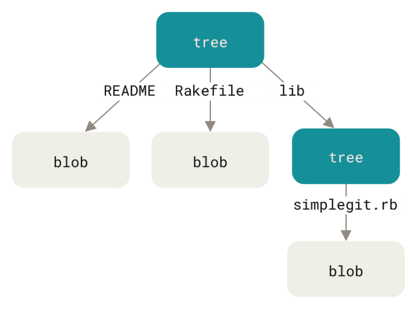
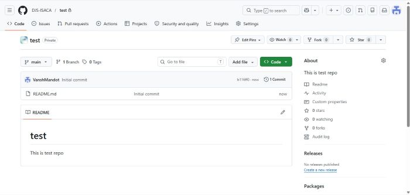
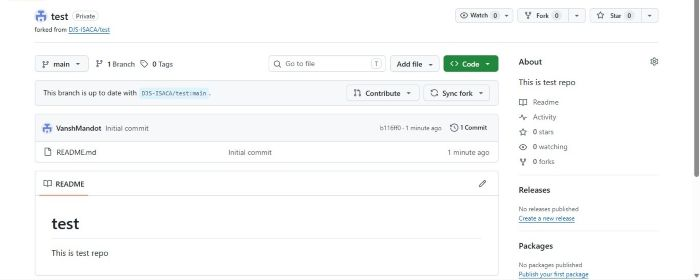
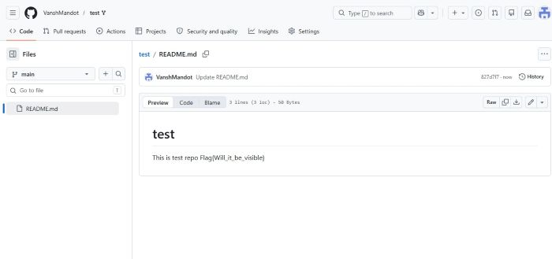
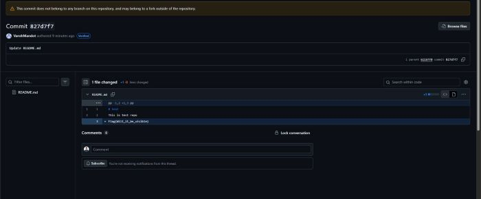

# GitHub's Hidden Attack Surface: Cross Fork Object Reference (CFOR) — A Deep Dive

---

## Table of Contents

1. [Introduction - The Illusion of Deletion](#introduction)
2. [How GitHub Actually Stores Data - Git's Object Model](#git-object-model)
3. [GitHub's Fork Network Architecture](#fork-network)
4. [What is Cross Fork Object Reference (CFOR)?](#what-is-cfor)
5. [The Three Attack Scenarios](#attack-scenarios)
   - [Scenario 1: Deleted Fork Data](#scenario-1)
   - [Scenario 2: Deleted Repository Data](#scenario-2)
   - [Scenario 3: Private Fork Data Leaking Through Public Parent](#scenario-3)
6. [How to Actually Access the Data - The Short SHA Trick](#short-sha-trick)
7. [Real-World Impact: 40 Live API Keys from 3 Repos](#real-world-impact)
8. [CTF in the Wild: TAMUctf 2026 Phantom 2](#ctf-challenge)
9. [Exploitation Tools](#exploitation-tools)
   - [TruffleHog by Truffle Security](#trufflehog)
   - [CFOR Exploit Script by SorceryIE](#sorcery-exploit)
10. [My Own Live Demo: DJS-ISACA Private Fork Leak](#my-demo)
11. [GitHub's Official Position](#github-position)
12. [Conclusion](#conclusion)

---

## 1. Introduction — The Illusion of Deletion {#introduction}

This is by far my favorite blog I’ve written. I was genuinely amazed when I discovered this vulnerability,  hope you enjoy reading it and learn something new!

When a developer pushes a secret to GitHub  an API key, a database password, a private SSH key  the usual instinct is to delete the commit, delete the branch, or even nuke the entire repository. Problem solved, right?

Wrong.

When you **delete a GitHub repository**, the data persists in the fork network's shared object store and remains accessible to anyone who can name the right commit hash. When you **make a fork private**, the commits you pushed to it are still readable through the parent repository. When you **delete a fork**, the data does not go with it.

This is not a bug GitHub is unaware of. It is, by their own admission, an intentional architectural decision. But for the overwhelming majority of developers who use GitHub every day, it is a silent, invisible trap  one that has led to thousands of live credentials being exposed in the wild.

This post is a comprehensive deep dive into **Cross Fork Object Reference (CFOR)**  a term coined by Truffle Security in July 2024 to name and formalize this behavior. We will cover the underlying architecture that makes it possible, the real-world attack scenarios, the tools used to exploit it, a CTF challenge built around it, and a live demonstration performed on a test organization.

---

## 2. How GitHub Actually Stores Data — Git's Object Model {#git-object-model}

To understand CFOR, you first need to understand how Git stores data under the hood.

### Content-Addressed Storage

Git is a **content-addressed filesystem**. Every piece of data Git manages  every file, every directory snapshot, every commit  is stored as an **object**, and each object is identified by the **SHA-1 hash of its contents**.

There are four types of Git objects:

| Object Type | What It Represents |
|-------------|-------------------|
| **blob** | The raw contents of a file |
| **tree** | A directory listing (maps filenames to blob/tree hashes) |
| **commit** | A snapshot: points to a tree, has a parent commit, metadata |
| **tag** | An annotated pointer to a commit |

The critical property: **identical content always produces the same hash**. If two files have exactly the same bytes, they produce exactly the same blob SHA-1. Git exploits this for deduplication  it never stores the same content twice.

### What a Commit Object Looks Like

When you run `git commit`, Git creates:

1. A **blob** for each changed file
2. A **tree** object capturing the directory state
3. A **commit** object pointing to that tree, plus metadata (author, timestamp, message, parent commit hash)

All of these are linked by their SHA-1 hashes. The commit hash you see in `git log` is the SHA-1 of the commit object itself.



### The Implication

Since objects are identified purely by their hash, **you can retrieve any object if you know its hash**  regardless of whether there is a branch or tag pointing to it. The Git protocol was designed this way. Unreferenced objects (objects with no branch/tag pointing to them) are called *dangling objects*, and Git's garbage collector eventually cleans them up locally. But GitHub, for engineering reasons, does not aggressively garbage-collect its shared object store.

This becomes the foundation of the CFOR vulnerability.

---

## 3. GitHub's Fork Network Architecture {#fork-network}

### What Actually Happens When You Fork

When you click "Fork" on GitHub, you are not getting an independent copy of the repository with its own storage. GitHub creates a **fork network**  a logical grouping of related repositories that all share a **single underlying object store**.

Think of it like a single warehouse with many labeled doors. Every fork is a different door, but they all lead to the same warehouse. When any fork pushes a new commit, the objects go into the shared warehouse. When any fork reads objects, it reads from that same shared warehouse.

```
                    ┌─────────────────────────────────────────────┐
                    │         SHARED OBJECT STORE                 │
                    │                                             │
                    │   blob:a1b2...   commit:d3ca...             │
                    │   tree:f4e5...   blob:9c8d...               │
                    │   commit:454b... tree:7b6a...               │
                    │                                             │
                    └──────────┬──────────────┬───────────────────┘
                               │              │
               ┌───────────────┘              └───────────────────┐
               ▼                                                   ▼
    ┌─────────────────────┐                           ┌──────────────────────┐
    │   upstream/repo     │                           │   user/private-fork  │
    │   (PUBLIC)          │                           │   (PRIVATE) 🔒       │
    │                     │                           │                      │
    │   refs/heads/main   │                           │  refs/heads/feature  │
    │   → commit:454b...  │                           │  → commit:d3ca...    │
    └─────────────────────┘                           └──────────────────────┘
```

### Why GitHub Designed It This Way

This is an engineering optimization at massive scale. If 50,000 developers fork the Linux kernel repository, GitHub does not want to store 50,000 complete copies of the Linux codebase. Instead, all 50,000 forks share the common base objects, and only the unique commits from each fork add new objects to the store.

The problem: **the access control boundary that separates "public" from "private" on GitHub's web interface does not extend to the object store layer.** GitHub enforces which *references* (branches, tags, refs) are visible based on repository permissions. But objects in the shared store can be accessed by any repository in the network  as long as the requester can name the object's hash.

This is the architectural root cause of CFOR.


---

## 4. What is Cross Fork Object Reference (CFOR)? {#what-is-cfor}

**Cross Fork Object Reference** is a term introduced by Truffle Security in July 2024. The naming is deliberately analogous to **IDOR (Insecure Direct Object Reference)**  a well-known web vulnerability class.

In an **IDOR**, you bypass authorization by directly supplying the identifier of an object that belongs to another user, rather than going through the normal access control flow.

In a **CFOR**, you bypass the visibility boundary between public and private forks by directly supplying the SHA-1 hash of a commit that belongs to another fork in the same network.

> **CFOR definition:** A vulnerability where one repository fork can access sensitive commit data from another fork — including data from private and deleted forks — by directly referencing the commit hash.

The key conditions for CFOR to be exploitable:

1. Two or more repositories exist in the same fork network (i.e., one was forked from the other, or both were forked from a common ancestor)
2. A commit exists in the shared object store that was pushed to a private or deleted fork
3. An attacker can discover or enumerate the commit hash

Condition 3 sounds like the hard part. As we will see, it is not.

---

## 5. The Three Attack Scenarios {#attack-scenarios}

Truffle Security documented three distinct scenarios where CFOR exposes data that users believe is protected.

### Scenario 1: Deleted Fork Data {#scenario-1}

**The workflow that causes exposure:**

```
1. Developer forks a public repository
2. Developer commits sensitive data (API key, credential, proprietary code) to the fork
3. Developer realizes the mistake (or finishes the work)
4. Developer deletes the fork
5. Developer assumes the data is gone
```

**What actually happens:**

When the fork is deleted, GitHub removes the fork's *references* (its branches and tags) from the system. But the commit objects that were pushed to the fork are already in the shared object store, and they stay there. The fork's deletion only removes the doors; the warehouse contents remain.

Any commit pushed to the deleted fork is permanently accessible through the parent repository as long as you know the commit hash.

Truffle Security demonstrated this by forking a repository, committing data to the fork, deleting the fork, and then successfully accessing the committed data through the parent repository. The commit was fully readable with its complete diff.

**Real-world frequency:** Truffle Security surveyed just three commonly-forked public repositories from a single large AI company and found **40 valid, live API keys** from deleted forks. The pattern was consistent: fork, hardcode key into example file, do work, delete fork, assume problem solved.

### Scenario 2: Deleted Repository Data {#scenario-2}

**The workflow that causes exposure:**

```
1. A developer creates a public repository
2. Another user forks it
3. The original developer continues pushing commits to the public repo
4. The forking user never syncs their fork with the upstream updates
5. The original developer deletes the entire repository
```

**What actually happens:**

When a public repository that has been forked is deleted, GitHub does not destroy the fork network. Instead, it **reassigns the root node** of the network to one of the downstream forks. The deleted repository's commits  including commits that were pushed *after* the forking user synced, and thus exist only in the deleted repo's namespace  are all still present in the shared object store.

All of those commits are accessible through any surviving fork, even commits the forking user never saw.

**The real incident:** Truffle Security reported a P1 (critical priority) vulnerability to a major tech company. The company had accidentally committed a private key with significant organization-wide GitHub access. The company immediately deleted the repository upon notification. However, because the repository had been forked, Truffle Security could still access the commit containing the private key through a surviving fork  even though that fork had never synced with the upstream.

> The implication: **any code committed to any public repository may be accessible forever as long as at least one fork of that repository exists.**

### Scenario 3: Private Fork Data Leaking Through Public Parent {#scenario-3}

**The workflow that causes exposure:**

```
1. An organization creates a private repository for a new internal tool
2. The organization creates a private internal fork to add proprietary features
3. The organization open-sources the main repository (makes it public)
4. The private fork remains private, containing internal/proprietary code
```

**What actually happens:**

When a private repository is made public, GitHub creates a new fork network for the public version. **However, any commits that were made to the private fork while the upstream was still private now exist in the shared object store of the public fork network.**

Those commits  from the private internal fork, containing proprietary features or credentials  are now accessible through the public repository.

There is one important boundary: commits made to the private fork *after* the upstream was made public are in a separate fork network (the private one) and are not accessible. But anything committed during the private phase before open-sourcing is exposed.

This is not an edge case. It is one of the most common workflows used by organizations that open-source software. Internal development happens in a private fork, the main repo goes public, and the private fork retains the internal version. Truffle Security confirmed finding internal code and credentials through exactly this pattern.

---

## 6. How to Actually Access the Data — The Short SHA Trick {#short-sha-trick}

Understanding that the data exists in the shared object store is one thing. Getting to it requires knowing the commit hash. Here is how that works in practice.

### Full SHA Access

If you know the full 40-character SHA-1 hash of a commit, accessing it is trivial:

```
https://github.com/owner/repo/commit/d3cab66d23265b36ecd8cd410554bdfc603e3416
```

GitHub will serve the commit page showing the full diff, even if the commit belongs to a private or deleted fork. It will display a yellow banner saying:

> *"This commit does not belong to any branch of this repository, and may belong to a fork outside of the repository."*

But this is a 40-character hex string — 1.2 × 10^48 possible values. You cannot brute-force that.

### Short SHA Resolution

Git has a feature called **short SHA resolution**. Rather than typing the full 40-character hash, Git accepts the minimum number of characters needed to unambiguously identify an object. The absolute minimum is **4 characters**.

GitHub exposes this same feature through its web interface and APIs. If you visit:

```
https://github.com/owner/repo/commit/d3ca
```

GitHub will search for any commit in the fork network whose SHA-1 starts with `d3ca` and redirect you to the full commit page.

**The critical implication:** A 4-character hex prefix has only **16^4 = 65,536 possible values**. That is an entirely brute-forceable space.

### GraphQL Batch Enumeration

The naive approach  hitting the REST API 65,536 times  is slow and rate-limited. The GitHub GraphQL API, however, supports **aliased queries**, which means you can batch multiple lookups into a single request.

A GraphQL query checking 400 prefixes at once looks like this:

```graphql
query {
  repository(owner: "owner", name: "repo") {
    a0000: object(expression: "0000") { ... on Commit { oid message } }
    a0001: object(expression: "0001") { ... on Commit { oid message } }
    a0002: object(expression: "0002") { ... on Commit { oid message } }
    # ... up to ~400 aliases per request
  }
}
```

Each alias returns either `null` (no matching commit in the network) or the full 40-character `oid` (SHA-1) and the commit message. By filtering out known commits from the parent repo's history, any remaining hits are commits from private or deleted forks.

**Performance comparison:**

| Method | Requests Needed | Estimated Time |
|--------|----------------|----------------|
| REST API (one prefix/request) | 65,536 | 12+ hours |
| GraphQL (80 per request) | ~820 | ~4 minutes |
| GraphQL (400 per request) | ~165 | ~1-2 minutes |

The GraphQL batching approach was independently developed by both Truffle Security (implemented in TruffleHog) and SorceryIE (published as a standalone exploit script), and is also the technique used in the TAMU-CTF 2026 CTF challenge described later in this post.

### The GitHub Events API — A Shortcut

Before you even need to enumerate commit hashes, the GitHub Events API can tell you that private fork activity exists. The Events API logs repository activity  including `ForkEvent` entries  and **private fork metadata is fully visible in the parent repository's events log**, even when the fork itself is inaccessible.

```bash
gh api 'repos/owner/repo/events'
```

A `ForkEvent` response will tell you:
- That a fork was created and who created it
- Whether the fork is marked as `private: true`
- When it was last pushed to (`pushed_at`)
- How much content it has (`size`)

This dramatically narrows the search: instead of scanning all 65,536 possible prefixes and filtering noise, you know exactly *when* the private commit was pushed, which lets you prioritize the scan or even find the commit hash through GitHub's events archive — a third-party service that has preserved all GitHub events for the past decade, even for deleted repositories.

---

## 7. Real-World Impact: 40 Live API Keys from 3 Repos {#real-world-impact}

The real-world data from Truffle Security's research is striking. By surveying just **three commonly-forked public repositories** from a single large AI company, they easily found **40 valid, live API keys** sourced from deleted forks.

The attack surface is far larger than these three repositories suggest. The pattern repeats across the entire ecosystem:

**Common credential exposure scenarios:**

- **Developer experimentation:** Fork a repo, hardcode an API key to test an integration, delete the fork when done. The key lives on.
- **Accident and remediation:** Push a credential by mistake, immediately delete the repo or fork, rotate nothing because you think deletion was enough. The credential is permanently accessible.
- **Open-source pipeline:** Develop a tool privately with internal API keys in config files, make the repo public for release. Commits from the private phase that landed in the shared object store before the visibility change are now publicly accessible.
- **Corporate fork networks:** An organization maintains a private internal fork of a public repo for enterprise customization. Any commits that were made during the fork's creation and before the public repo became public may be accessible through the public repo.

The implications for security teams are significant:

1. **Rotating is the only remediation.** If a secret was committed to any repository in a fork network at any time, the only reliable remediation is to rotate the credential. Deleting the commit, the branch, the repo, or the fork does not remove the object from the shared store.

2. **GitHub's fork network boundary is not a security boundary.** Organizations that assume their private forks are isolated from public forks in the same network are operating on a false assumption.

3. **Historical exposure is permanent.** There is no expiry, no garbage collection, no mechanism by which old commits in a shared object store are eventually destroyed. Commits from 2018 are as accessible today as they were then.

---

## 8. CTF in the Wild: TAMUctf 2026 Phantom  {#ctf-challenge}

The CFOR technique is not just a theoretical security research finding — it has already made it into competitive cybersecurity challenges. TAMUctf 2026 included a forensics challenge called **Phantom 2** that was built entirely around this vulnerability.

The challenge was designed by user *cobra* and handed participants a link to a nearly empty public repository (`github.com/tamuctf/phantom2`) with a single commit and only a two-word README. The flag was sitting inside a commit pushed to a **private fork** of that repository.

A friend of mine, **187OnAnUndercoverCop** (writing as part of the RootRunners CTF team), solved this challenge and published a detailed writeup. Here is a summary of the solve path:


This challenge is a perfect pedagogical example of CFOR in action. The entire solve path mirrors a real-world attack: reconnaissance via Events API, enumeration via GraphQL batching, access via direct commit URL. The only difference from a real attack is that the "secret" was a CTF flag rather than an API key.

>  **Read the full CTF writeup here:** [TAMUctf 2026: Phantom 2 — 187OnAnUndercoverCop's Blog](https://blog.roblab.us/writeups/tamuctf2026-phantom-2/)

---

## 9. Exploitation Tools {#exploitation-tools}

### TruffleHog by Truffle Security {#trufflehog}

Truffle Security  the company that named and formally documented CFOR  has implemented CFOR enumeration directly into their open-source secret scanning tool, **TruffleHog**.

The `--object-discovery` flag triggers the CFOR enumeration module:

```bash
trufflehog github-experimental \
  --repo https://github.com/<USER>/<REPO>.git \
  --object-discovery
```

**Prerequisites:**
- A valid GitHub access token set in environment: `export GITHUB_TOKEN=ghp_...`
- Or passed on the command line: `--token ghp_...`

**How TruffleHog's CFOR module works:**

1. **Estimate total objects:** Clone all accessible commit objects using standard `git clone` and count the total number of used hashes. Adds an estimate based on the number of forks and average commits per fork.

2. **Estimate collision rate:** Uses the Birthday Paradox to calculate how many collisions will occur at 4, 5, and 6 character Short SHA-1 lengths. A 4-character prefix gives 65,536 possibilities; 5 characters gives ~1 million; 6 characters gives ~17 million.

3. **Select optimal prefix length:** Chooses the shortest prefix length that stays below a configurable collision threshold (default: 1 collision). This balances completeness against enumeration time.

4. **Build and query keyspace:** Removes known used hashes from the keyspace, then queries GitHub's GraphQL API in batches of several hundred prefixes per request to identify valid hidden commits.

5. **Scan discovered commits for secrets:** Runs TruffleHog's standard secret detection engine against all discovered commits.

**Output files:**

TruffleHog creates a `~/.trufflehog/` directory containing:
- `valid_hidden.txt` — All discovered hidden commit hashes
- `invalid.txt` — Prefixes that returned no results

These files allow resuming interrupted scans and give security researchers a list of hidden commits to review manually.


> 🔗 **TruffleHog on GitHub:** [github.com/trufflesecurity/trufflehog](https://github.com/trufflesecurity/trufflehog)

### CFOR Exploit Script by SorceryIE {#sorcery-exploit}

Independently of TruffleHog's implementation, a security researcher named **SorceryIE** developed their own CFOR exploitation script and published it as open source. The key insight in their implementation  arrived at independently before TruffleHog implemented it  was the same GraphQL batching technique.

SorceryIE found that ~400 commit prefixes per GraphQL query was stable and consistent. Their script:


> 🔗 **CFOR Exploit Script:** [github.com/SorceryIE/cfor_exploit](https://github.com/SorceryIE/cfor_exploit)

---

## 10. My Own Live Demo: DJS-ISACA Private Fork Leak {#my-demo}

To verify this vulnerability in a controlled environment, I performed a live test using a private organization I have access to: **DJS-ISACA**.

Here is exactly what I did, step by step.

### Step 1 — Create a Test Repository in the Private Org

I created a test repository inside the DJS-ISACA organization. At this stage, the repository was **private**. This is the "upstream" repository that will eventually be made public.




### Step 2 — Fork It Privately and Add a "Secret"

I forked the repository into a private fork named **test-2** within the same organization. Into this private fork, I pushed a commit that added a file containing a flag — simulating what a developer might do when adding credentials or internal configuration to a private fork.

The commit was made **only to the private fork**, never to the main repository.



### Step 3 — Make the Main Repository Public

Next, I changed the visibility of the **main test repository** (not the fork) from private to public. This mirrors the common workflow of open-sourcing an internal project.

At this point, the main repo is public. The fork is still private. A reasonable expectation would be: the private fork's commits are not visible to the public.



### Step 4 — Accessing the Private Fork's Commits from an Outside Device

Using a **completely separate device** with no session cookies, no GitHub login, and no access to the DJS-ISACA organization, I navigated directly to the commit URL from the private fork — accessed through the **public main repository's** URL structure.

The result:



The commit was fully readable. The diff showed the flag that was added only to the private fork. The yellow GitHub banner confirmed: *"This commit does not belong to any branch of this repository, and may belong to a fork outside of the repository."*

**That banner is GitHub telling you, in plain text, that you are reading data from a fork you should not have access to.**

### What This Proves

This demonstration confirms all three of the documented CFOR scenarios apply in practice:

- **The private fork's commits are accessible** through the public parent repo
- **No authentication to the private org is required** — any anonymous user can read the commit
- **The data persists** even if the fork is later deleted
- **The "private" label on the fork** provides no protection at the object storage layer

---


## 11. GitHub's Official Position {#github-position}

Truffle Security submitted their findings to GitHub through the official Vulnerability Disclosure Program (VDP). GitHub's response was clear: **this is not a vulnerability; it is documented, expected behavior.**

GitHub's stance is defensible from a pure engineering perspective. The Git protocol was never designed with the assumption that unreferenced objects would be inaccessible. GitHub documents the fork network architecture and its behavior during repository deletion and visibility changes in their official documentation:

> [What happens to forks when a repository is deleted or changes visibility](https://docs.github.com/en/pull-requests/collaborating-with-pull-requests/working-with-forks/what-happens-to-forks-when-a-repository-is-deleted-or-changes-visibility)

Truffle Security's counterargument — and the one that matters from a security perspective — is the **expectation gap**:

- The average developer views the separation of public and private repositories as a **security boundary**.
- The act of **deletion implies destruction of data**.
- The **"private" label on a repository or fork implies access restriction**.

None of these intuitions are accurate for GitHub's fork network architecture, and GitHub does not prominently surface this information during the actions (deletion, forking, visibility changes) where it matters most.

The result is that an enormous number of developers have made security decisions based on false assumptions — assumptions that GitHub technically documented but that most users will never encounter.

---

## 12. Conclusion {#conclusion}

Cross Fork Object Reference is one of those vulnerabilities that, once you understand it, makes you realize how many assumptions about platform security are simply wrong. GitHub is not unusual in having gaps between user expectations and architectural reality. But given GitHub's scale — hosting hundreds of millions of repositories, used by virtually every software organization in the world — the impact of this particular gap is unusually large.


The tools to exploit this are publicly available and relatively easy to use. TruffleHog's `--object-discovery` flag and SorceryIE's exploit script both implement the GraphQL batching technique that makes enumeration practical. The TAMUctf 2026 Phantom 2 challenge showed that the technique is well-understood enough to build competitive security challenges around it.

If you use GitHub professionally, run TruffleHog against your public repositories with object discovery enabled. The results may surprise you.

---

## References & Further Reading

- **Truffle Security — Original CFOR Research (July 2024):**
  [trufflesecurity.com/blog/anyone-can-access-deleted-and-private-repo-data-github](https://trufflesecurity.com/blog/anyone-can-access-deleted-and-private-repo-data-github)

- **Truffle Security — TruffleHog CFOR Implementation (August 2024):**
  [trufflesecurity.com/blog/trufflehog-now-finds-all-deleted-and-private-commits-on-github](https://trufflesecurity.com/blog/trufflehog-now-finds-all-deleted-and-private-commits-on-github)

- **TAMUctf 2026 Phantom 2 CTF Writeup:**
  [blog.roblab.us/writeups/tamuctf2026-phantom-2/](https://blog.roblab.us/writeups/tamuctf2026-phantom-2/)

- **SorceryIE — CFOR Exploit Script:**
  [github.com/SorceryIE/cfor_exploit](https://github.com/SorceryIE/cfor_exploit)

- **SorceryIE — Blog Post on GraphQL Batching Technique:**
  [blog.sorcery.ie/posts/cfor_exploit/](https://blog.sorcery.ie/posts/cfor_exploit/)

- **GitHub Documentation — Fork Behavior on Deletion/Visibility Change:**
  [docs.github.com/en/pull-requests/collaborating-with-pull-requests/working-with-forks/what-happens-to-forks-when-a-repository-is-deleted-or-changes-visibility](https://docs.github.com/en/pull-requests/collaborating-with-pull-requests/working-with-forks/what-happens-to-forks-when-a-repository-is-deleted-or-changes-visibility)

- **How to Rotate Leaked Credentials:**
  [howtorotate.com](https://howtorotate.com)

---

*Written as part of ongoing security research. All demonstrations were performed on repositories and organizations under my own control. No third-party systems were accessed without authorization.*

